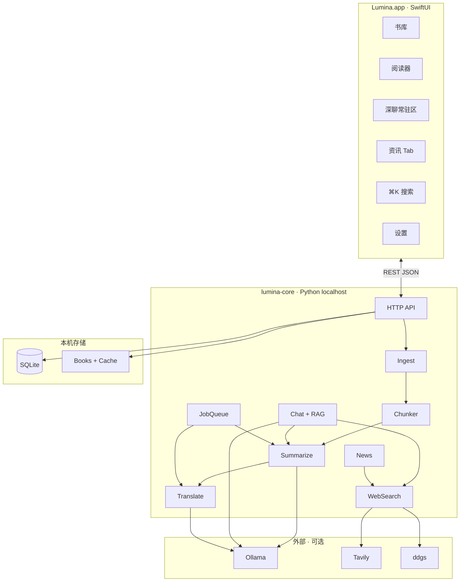
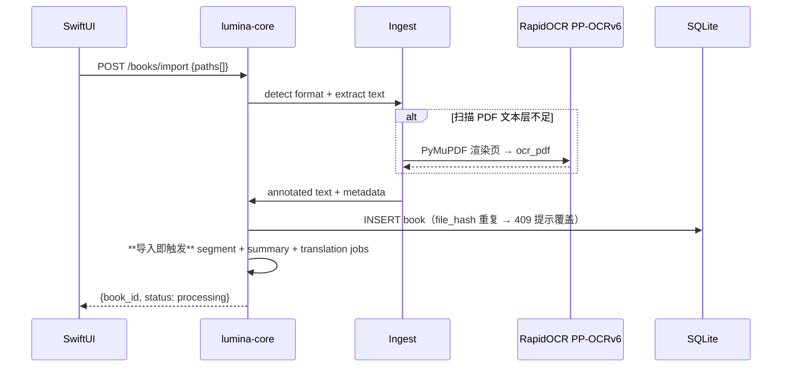
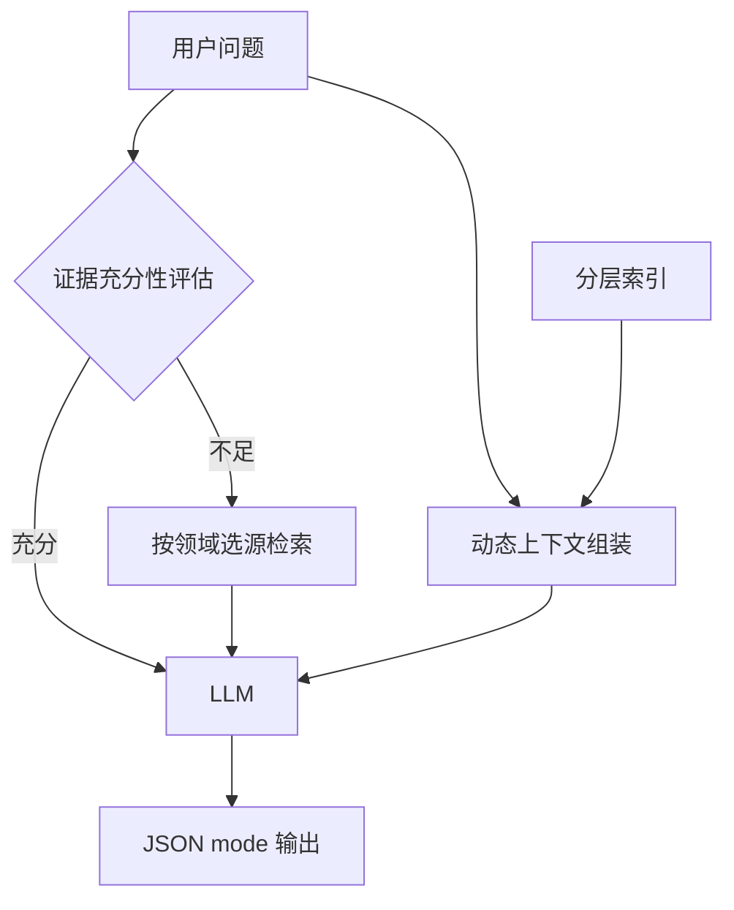

# Lumina 技术设计文档（TDD v1.0）

**产品真源**：[PRD.md](PRD.md) · Local AI Reading Companion · AI 伴读  
**版本范围**：v1.0 Mac MVP  
**原则**：独立重写；算法与数据流参考 LocalAgent `summarize` / `news` / `web_search`，**不引入** LangGraph · Mem0 · Chroma 整栈。

---

## 0. 技术决策摘要

| 决策项 | v1.0 结论 | 理由 |
|--------|-----------|------|
| UI 响应性 | **永不卡住用户**（PRD 章程 0）：重活离事件循环 / 离 MainActor；列表 API 不含全文 | 最高原则 |
| Mac UI | **SwiftUI 原生** | 浅色主界面、动效、阅读体验；PRD 原则 8 |
| AI / 文档引擎 | **Python `lumina-core` 本地 sidecar** | 快速移植 LA 分段/摘要/联网算法；与 Swift UI 解耦 |
| App ↔ Core 通信 | **localhost HTTP（JSON REST）** | 简单、可独立调试；后续可换 XPC |
| 数据库 | **SQLite**（`GRDB` Swift 读 + Core 写，或 Core 独占） | PRD 数据模型；跨平台铺路 |
| 向量检索（跨书 recall） | **sqlite-vec** + BM25 混合 | 轻量、本地、无额外服务 |
| OCR | **RapidOCR / PP-OCRv6**（`lumina-core`） | 与 LA 同栈；中英文/古文更强；跨平台统一 |
| 文档解析 | **ebooklib** 为核心自建 EPUB pipeline；pypdf · mobi · PyMuPDF OCR | B1 |
| Ollama | 摘要/翻译：**httpx 直连**本地 Ollama | B10 |
| 深聊模型 | **推荐外部 API**（OpenRouter 等）；与摘要/翻译 **分开配置** | B4/B10 GPU |
| 联网搜索 | **证据充分性驱动**（非关键词）；源：DDG · Wikipedia · arXiv · Open Library · GitHub | B5 |
| 开源协议 | **MIT** | — |
| 书籍存储 | 导入时**复制**；`file_hash` 重复 → **提示是否覆盖** | B1 |
| 分段时机 | **导入即开始**分段+摘要 prefetch | B11 |
| 批量队列 | 10+ 本可同时导入；OCR/分段并发 **默认 1**，随模型配置可调 | B1 |
| 超大文件 | **>500MB 警告并拒绝** | B1 |
| 段失败 | `error` 态；**重试 3 次**后标记失败 | B2 |
| 磁盘 quota | 超长书 segment 缓存设**上限** | B11 |
| 翻译 v1 | **自动 LLM 翻译**，用户无感知；v1 不单独处理古文 | B3 |
| 深聊输出 | **LLM JSON mode** 结构化 `{answer, citations, web_refs}` | B6 |
| Token 长线程 | **分层索引 + 动态上下文组装**（见 §4.6） | B4 |
| 段内高亮 | v1.0 **整段闪高亮** | B6/B7 |
| 导出 | Markdown **默认含译文**；翻译对用户不可见 | B9 |
| Ollama 首次体验 | 参考 LocalAgent `la setup`（RAM 分档 + pull） | B10 |
| 资讯简报 | RSS **标题 + excerpt 规则截取** | N2 |
| 深聊线程 | 每书一个 thread | B4 |

---

## 1. 系统架构



### 1.1 分层职责

| 层 | 职责 | 不做 |
|----|------|------|
| **SwiftUI App** | 书库/阅读器/深聊 UI、Sidecar 生命周期、文件导入 UX | LLM prompt、分段算法、OCR |
| **lumina-core** | 摄入、分段、摘要、翻译、深聊、联网、资讯 sync、SQLite 写入 | 原生 UI |
| **SQLite + 文件** | 结构化元数据、段缓存、笔记、对话、FTS/向量索引 | 云端同步 |

### 1.2 Sidecar 生命周期

1. App 启动 → 检测 `lumina-core` 是否运行（health `GET /health`）
2. 未运行 → 启动 bundled Python 可执行文件（PyInstaller）或 `uv run lumina-core`（开发模式）
3. 绑定 `127.0.0.1:{port}`（默认 `17432`，冲突时递增）
4. App 退出 → 发送 `POST /shutdown`（graceful）；超时 SIGTERM

---

## 2. 仓库结构

```
Lumina/
├── apps/
│   └── macos/
│       └── Lumina/                 # SwiftUI Xcode project
│           ├── App/
│           ├── Features/
│           │   ├── Library/
│           │   ├── Reader/         # 段列表 + 段内容 + 深聊
│           │   ├── News/
│           │   ├── Search/
│           │   └── Settings/
│           ├── Services/
│           │   ├── CoreClient.swift    # HTTP → lumina-core
│           │   └── SidecarManager.swift
│           └── DesignSystem/
├── packages/
│   └── lumina-core/                # Python ≥3.11
│       ├── pyproject.toml
│       ├── lumina_core/
│       │   ├── main.py             # FastAPI entry
│       │   ├── api/                # REST routes
│       │   ├── ingest/             # load PDF/EPUB/MOBI/TXT
│       │   ├── chunker/            # 参考 LA chunker + chonkie
│       │   ├── summarize/          # 段摘要 + label + prefetch
│       │   ├── translate/          # LLM 翻译（非 deep-translator）
│       │   ├── chat/               # 深聊 + RAG + citation
│       │   ├── search/             # 跨书 recall + web
│       │   ├── news/               # RSS sync / rank / brief
│       │   ├── models/             # Ollama httpx router
│       │   ├── db/                 # SQLite schema + repos
│       │   └── jobs/               # 后台 prefetch 队列
│       └── tests/
├── docs/
│   ├── PRD.md
│   ├── TDD.md
│   └── design/
└── scripts/
    ├── dev.sh                    # 同时起 core + open Xcode
    └── bundle-core.sh            # PyInstaller for release
```

---

## 3. 数据层

### 3.1 存储根目录

```
~/Library/Application Support/Lumina/
├── lumina.db                       # SQLite 主库
├── books/                          # 导入文件副本或 symlink
│   └── {book_id}/
│       └── original.{pdf|epub|…}
├── cache/
│   └── segments/{book_id}/         # 段摘要 JSON 备份（可选，主存 DB）
├── news/
│   └── articles.sqlite             # 资讯独立库（或合并 lumina.db）
├── config.json                     # 非敏感 Settings（语言、联网 provider 等）
├── models.json                     # 模型资源池与路由（不含 API Key）
└── secrets.json                    # API Key / Tavily Key（0600，仅本机 core 读写）
```

### 3.2 SQLite Schema（v1.0）

```sql
-- 书籍
CREATE TABLE books (
  id            TEXT PRIMARY KEY,
  title         TEXT NOT NULL,
  author        TEXT,
  format        TEXT NOT NULL,          -- pdf|epub|mobi|txt
  file_path     TEXT NOT NULL,
  cover_path    TEXT,
  language      TEXT,                   -- 检测源语言
  target_language TEXT,
  translation_mode TEXT DEFAULT 'auto', -- auto|original|bilingual
  segment_count INTEGER DEFAULT 0,
  current_segment_index INTEGER DEFAULT 0,
  status        TEXT DEFAULT 'unread',  -- unread|reading|summarized
  file_hash     TEXT,                   -- 缓存失效
  created_at    TEXT,
  updated_at    TEXT
);

-- 段
CREATE TABLE segments (
  id              TEXT PRIMARY KEY,
  book_id         TEXT NOT NULL REFERENCES books(id),
  idx             INTEGER NOT NULL,       -- 0-based 段序号
  chapter         TEXT,
  page_range      TEXT,
  anchor_label    TEXT,                   -- 〔§… · 段 N · p.…〕
  raw_text        TEXT,
  summary_json    TEXT,                   -- {sentences[], bullets[], anchor}
  label           TEXT,                   -- ≤20 字浓缩标签
  translation     TEXT,
  summary_status  TEXT DEFAULT 'pending', -- pending|running|ready|error|failed
  UNIQUE(book_id, idx)
);

-- 笔记（必须挂段；孤儿笔记迁移时删除）
CREATE TABLE notes (
  id          TEXT PRIMARY KEY,
  book_id     TEXT NOT NULL REFERENCES books(id),
  segment_id  TEXT NOT NULL REFERENCES segments(id),
  quote       TEXT,
  content     TEXT NOT NULL,
  type        TEXT NOT NULL,              -- manual|highlight|ai
  created_at  TEXT
);

-- 深聊会话
CREATE TABLE chat_sessions (
  id          TEXT PRIMARY KEY,
  book_id     TEXT NOT NULL,
  scope       TEXT DEFAULT 'book',        -- segment|book
  segment_id  TEXT,
  updated_at  TEXT
);

CREATE TABLE chat_messages (
  id          TEXT PRIMARY KEY,
  session_id  TEXT NOT NULL REFERENCES chat_sessions(id),
  role        TEXT NOT NULL,              -- user|assistant
  content     TEXT NOT NULL,
  citations_json TEXT,                    -- [{segment_id, label}]
  web_refs_json  TEXT,                    -- [{url, title}]
  created_at  TEXT
);

-- FTS5 跨书搜索（笔记 + 段摘要 + 书名）
CREATE VIRTUAL TABLE search_fts USING fts5(
  book_id, segment_id, note_id, kind, title, body,
  tokenize='unicode61'
);

-- sqlite-vec 段向量（可选 v1.0 spike 后启用）
-- CREATE VIRTUAL TABLE segment_embeddings USING vec0(...);
```

### 3.3 缓存失效

段摘要/翻译缓存失效条件（与 LA `segment_cache` 对齐）：

- `books.file_hash` 变化
- Ollama 模型名变化
- `target_language` / `translation_mode` 变化
- chunker 参数版本 bump（`CHUNKER_VERSION` 常量）

---

## 4. 核心流水线

### 4.1 书籍导入



**导入策略（v1.0）**

| 规则 | 行为 |
|------|------|
| 文件存储 | 复制到 `books/{id}/` |
| 大小限制 | **>500MB → 警告并拒绝** |
| 重复检测 | 同 `file_hash` → App 弹窗**是否覆盖** |
| 批量导入 | 10+ 本可同时提交；每本独立 job |
| 分段时机 | **导入完成即开始**分段（不等打开书） |
| OCR/分段并发 | 默认 **1**（内部常量，用户不可配） |

**格式解析（Core）**

| 格式 | 库 | 备注 |
|------|-----|------|
| PDF（文本层） | `pypdf` | 页码锚点 |
| PDF（扫描） | **PyMuPDF + RapidOCR PP-OCRv6** | 覆盖率 < 15% 触发 |
| EPUB | **`ebooklib` 为核心**，自建解析 Pipeline（spine → 章节 → 纯文本 + § 锚点） | 不用 epub2txt |
| MOBI | `mobi` | 同 LA |
| TXT/MD | 内置 | charset 检测 |

### 4.1a OCR 方案（RapidOCR / PP-OCRv6）

**为何不用 Vision.framework**

| 维度 | Vision.framework | RapidOCR / PP-OCRv6 |
|------|------------------|---------------------|
| 架构 | Swift OCR → 回传 Core，**双端流水线** | 全在 `lumina-core`，与 ingest 一体 |
| 中文/古文扫描 | 一般 | LA 已验证，PP-OCRv6 更适合 |
| 跨平台 | 仅 Apple | Mac / Windows / Linux 同一套 |
| 与 LA 复用 | 需重写 | **直接参考** `ingest/ocr.py` |
| 依赖 | 零额外 | `rapidocr` + `onnxruntime` + `pymupdf`（可打包进 sidecar） |
| 页级进度 | 需 Swift 实现 | LA 已有 `on_progress` 回调 |

TDD 初版选 Vision 是为「Mac 零依赖」；在 **Python sidecar 已成立** 的前提下，该理由不成立，且增加 Swift↔Core OCR 回传复杂度。

**实现（参考 LocalAgent `ingest/ocr.py`）**

```python
# lumina_core/ingest/ocr.py — 独立重写，算法对齐 LA
RapidOCR(params={
    "Det.ocr_version": OCRVersion.PPOCRV6,
    "Rec.ocr_version": OCRVersion.PPOCRV6,
    "Det.lang_type": config.OCR_LANG,  # ch / en / …
})
# ocr_pdf: PyMuPDF 逐页渲染 → OCR → ## [p.N] 段落
```

**依赖**（`lumina-core[ocr]` extra）：

- `rapidocr-onnxruntime` 或 `rapidocr`
- `onnxruntime`
- `pymupdf`

**配置**

| 项 | 默认 |
|----|------|
| `OCR_LANG` | `ch`（简中；古文扫描书优先） |
| `OCR_TIER` | `medium`（同 LA 档位） |
| 触发阈值 | 文本层覆盖率 < 15% |

**进度 UX**：OCR 经 SSE 推送 `{book_id, page, total}`；App 显示段级 skeleton，不 blocking 全屏。

### 4.2 智能分段（Chunker）

参考 LocalAgent [`ingest/chunker.py`](https://github.com/vedas-dixit/LocalAgent) + **chonkie** `RecursiveChunker`：

```
annotate(text) → 注入 ## [§章节] / ## [p.N] 标记
  → 结构边界切分（Markdown # / LA 锚点行）
  → RecursiveChunker（语义边界优先；Ollama target ~2500 字（60%–120% 浮动），云端 ~4000 字）
  → rebalance：过小 merge、过大句子级 split
  → DocumentSegment[] + chapter/page 元数据
```

**Lumina 参数（v1.0 默认）**

| 参数 | Ollama 本地 | 云端 API |
|------|-------------|----------|
| `reading_target_chars` | 2500 | 4000 |
| `reading_hard_max` | 3000 | 6000 |
| prefetch workers | 1 | 4 |
| 短书阈值 | ≤12000 字不切段 | 同 |

环境变量覆盖：`LUMINA_CHUNK_TARGET_CHARS`、`LUMINA_CHUNK_MAX_CHARS`（见 `resolve_chunk_budget()`）。

### 4.3 段摘要 + Label

**单次 LLM 调用产出**（减少延迟）：

```json
{
  "sentences": ["…", "…", "…"],
  "bullets": [
    {"label": "要点", "body": "1～2 句充实说明（40～120 字）…"}
  ],
  "notes": ["…"],
  "follow_ups": ["引导问题 1？", "引导问题 2？"],
  "label": "王安石变法背景",
  "anchor": "§第三章 · 段 5 · p.42-48"
}
```

Prompt 约束：label ≤20 字；sentences ≤3；bullets 3–7 条（每条 label ≤8 字、body ≥20 字）；notes 0–3 条（可选）；follow_ups 0–3 条。

**Prefetch 与失败策略（v1.0）**

```
pending → running → ready | error（重试≤3）→ failed
```

- **导入即开始**：segment 切分完成后立即 queue 摘要 job；段 1 优先
- 后台 JobQueue：按 provider Semaphore 限流（Ollama 默认 **2**、Cursor **8**、Cloud **4**）；worker 数 = 摘要链 max
- 用户打开书时：若段 1 已 ready → 直接呈现；否则 skeleton 等待
- 用户跳转未 ready 段：priority=high 插队
- **失败重试**：每段最多 **3 次**；仍失败 → `summary_status=failed`，段列表显示 error，可手动重试
- **磁盘 quota**：单书 segment 缓存（摘要+译文+原文）默认上限 **2GB**（可配置）；超限 LRU 淘汰最旧未读段缓存
- 进度：SSE `GET /books/{id}/events`

**段摘要 LLM 输出（JSON mode）**

```json
{
  "sentences": ["…"],
  "bullets": [
    {"label": "要点", "body": "充实说明…"}
  ],
  "notes": [],
  "follow_ups": ["可追问的问题？"],
  "label": "王安石变法背景",
  "anchor": "§第三章 · 段 5 · p.42-48"
}
```

旧格式 `bullets: ["标签：内容"]` 仍可解析；新生成须为 `{label, body}` 对象数组。

### 4.4 自动翻译（用户无感知）

- v1.0：**不单独做语种检测/古文特殊处理**；目标语言 ≠ 用户设定语言时，**自动 LLM 翻译**
- 翻译是系统能力，**无用户可见按钮或开关**（书详情高级设置除外）
- 翻译 job 使用 **`translate` 模型配置**（默认本地 Ollama）
- 与摘要 prefetch 并行；优先级低于摘要（见 §4.5a）
- 术语一致性：书级 glossary 写入 `books.metadata_json`
- UI：外文书 / 需翻译书自动呈现译文；用户只读内容，不感知「翻译层」

### 4.5 模型路由与任务优先级（v1.0）

**三套独立模型配置**（`config/models.yaml`）：

| 用途 | 默认 Provider | 说明 |
|------|---------------|------|
| **chat**（深聊） | **外部 API 推荐**（OpenRouter 等） | 响应快、上下文长；Local First 仍可用 Ollama |
| **summarize**（段摘要+label） | **Ollama 本地** | 零账单主路径 |
| **translate** | **Ollama 本地** | 与 summarize 可同模型 |

**GPU / Job 优先级**（高 → 低）：

```
深聊 (chat)  →  段摘要 (summarize)  →  翻译 (translate)
```

- 用户发起深聊 → **暂停**低优 prefetch job，优先响应 chat
- 深聊走 `chat` 配置；摘要/翻译走各自 Ollama 配置
- OCR/分段 CPU 任务与 LLM job 分池

### 4.6 深聊（文档 + 联网 + 长线程）



#### 4.6.1 分层索引 + 动态上下文组装（Hierarchical Index + DCA）

全书 thread 变长后，不用简单截断最近 N 轮，而是：

| 层级 | 内容 | 用途 |
|------|------|------|
| L0 书级 | 书名、章节大纲、全书进度 | 导航 |
| L1 段级 | 每段 `label` + 三句话摘要 + bullets | **摘要导航** |
| L2 证据级 | 当前段 + RAG 召回段 **原文** | **原文溯源** |

**动态上下文组装**：根据用户问题从 L1 选相关段 → L2 注入原文片段 → 拼接最近对话 → 送入 chat 模型。以摘要导航、原文溯源，支撑长文本连续深聊。

#### 4.6.2 证据充分性驱动的联网（Evidence Sufficiency）

**不用关键词触发**。流程：

1. 先用本地上下文（当前段 + RAG top-k）评估能否**高置信**回答
2. 若 **Evidence Sufficiency 不足** → 进入联网
3. 按问题**意图与领域**选源（可并行）：

| 领域信号 | 检索源 |
|----------|--------|
| 通用事实/背景 | **Wikipedia** + DuckDuckGo |
| 学术/论文 | **arXiv** + DDG |
| 书籍/作者元数据 | **Open Library** |
| 代码/项目 | **GitHub** + DDG |
| 默认 | DuckDuckGo |

- 设置中可关联网；无网仅本地
- 每轮最多 1 轮联网检索；结果标 `[网]`

#### 4.6.3 深聊 JSON 输出

LLM **JSON mode** 强制结构：

```json
{
  "answer": "…",
  "citations": [{"segment_index": 5, "label": "[段 5]"}],
  "web_refs": [{"title": "…", "url": "…"}],
  "evidence_sufficient": true
}
```

- Swift 解析后渲染可点击 citation；v1.0 跳转 **整段闪高亮**
- 源约束：书中事实必须有 citation；联网内容走 `web_refs`

**对话线程**：每书一个 thread；切段更新 DCA 输入，不新开 thread。

### 4.7 跨书 Recall（⌘K）

v1.0 实现路径：

1. **FTS5** 索引：`books.title`、`segments.summary_json`、`notes.content`
2. 搜索：`search_fts MATCH ?` + 按 kind 分组
3. v1.1 增强：sqlite-vec 语义召回

Swift：`SearchView` → `GET /search?q=…` → 跳转 `ReaderView(bookId, segmentId)`

### 4.8 资讯 lite

复用 LA 算法，简化存储：

| 模块 | 参考 | Lumina |
|------|------|--------|
| sync | `news/sync.py` + `rss.py` | `POST /news/sync` |
| store | `news/store.py` | `news_articles` 表 |
| rank | `news/rank.py` | 规则排序，无 LLM |
| brief | `news/brief.py` | `GET /news/brief` — **标题 + RSS excerpt 规则截取**，不用 LLM |
| 精读 | `news/read.py` + trafilatura | 单篇 → 临时 segment + 复用 Chat |

**不做**：`schedule` 定时 sync（v1.1）

**并行**：书库后台摘要/翻译与资讯 sync · 精读 · 深聊互不抢占，可同时进行（共享本机 Ollama 并行度上限）。

---

## 5. HTTP API 概要（v1.0）

Sidecar 绑定 `127.0.0.1` only；无认证（本机进程）。

### 5.1 书籍

| Method | Path | 说明 |
|--------|------|------|
| GET | `/health` | Sidecar 存活 |
| POST | `/books/import` | 导入文件/文件夹；**409** + `{existing_book_id}` 若 `file_hash` 重复 |
| POST | `/books/{id}/import/overwrite` | 用户确认覆盖后重新导入 |
| GET | `/books` | 书库列表；`?collection=all\|unread\|reading\|summarized`；`?sort=recent\|added\|title\|favorite` |
| GET | `/books/categories` | 固定 LLM 主分类枚举 |
| PATCH | `/books/{id}` | 更新收藏 / 分类 / 标题 |
| DELETE | `/books/{id}` | 删除书及本地副本、摘要、笔记 |
| POST | `/books/{id}/classify` | 后台 LLM 重新分类 |
| GET | `/books/{id}` | 书籍详情 |
| PATCH | `/books/{id}/reading-progress` | 更新当前段进度 |
| GET | `/books/{id}/segments` | 段列表（含 label、summary_status） |
| GET | `/books/{id}/segments/{idx}` | 单段详情 |
| POST | `/books/{id}/open` | 打开书（订阅 SSE；**不触发**分段，导入时已 queue） |
| POST | `/books/{id}/segments/{idx}/retry` | 手动重试单段摘要 |
| POST | `/books/{id}/segments/retry` | 批量重试段摘要（body: `{ indices: number[] }`） |
| POST | `/books/{id}/summarize/regenerate` | 全书强制重新摘要（含 ready 段） |
| GET | `/books/{id}/events` | SSE：段摘要/翻译 progress |

### 5.2 阅读与 AI

| Method | Path | 说明 |
|--------|------|------|
| POST | `/books/{id}/chat` | 深聊（stream SSE） |
| GET | `/books/{id}/chat/sessions` | 会话列表 |
| POST | `/books/{id}/export` | 导出 Markdown |

### 5.3 笔记与搜索

| Method | Path | 说明 |
|--------|------|------|
| POST | `/notes` | 创建笔记（`segment_id` 必填；须属于该书） |
| GET | `/notes?book_id=&segment_id=` | 有 `book_id` → 书内列表（可按段筛）；无 → 跨书列表 |
| DELETE | `/notes/{id}` | 删除单条笔记（同步清理 FTS） |
| GET | `/search?q=` | 跨书 FTS |

列表响应每条含 `segment_index`、`segment_label`；跨书时另含 `book_title`（不含 `raw_text`）。

### 5.4 资讯

| Method | Path | 说明 |
|--------|------|------|
| GET/POST | `/news/sources` | RSS 源管理 |
| POST | `/news/sync` | 手动同步 |
| GET | `/news/brief` | 今日简报 |
| POST | `/news/articles/{id}/chat` | 单篇深聊 |

### 5.5 设置

| Method | Path | 说明 |
|--------|------|------|
| GET/PUT | `/settings` | 三 Profile 模型、语言、web 开关；各 API 资源含 `concurrency` |
| GET | `/settings/ollama/status` | 连接检测 + RAM 分档推荐模型 + pull 状态 |
| POST | `/settings/ollama/setup` | 参考 LA `la setup`：检测/安装/pull |

---

## 6. SwiftUI 架构

### 6.1 阅读器状态（ReaderViewModel）

```swift
@MainActor
final class ReaderViewModel: ObservableObject {
  @Published var book: Book
  @Published var segments: [SegmentRow]      // 章节分组 + label
  @Published var currentSegment: SegmentDetail?
  @Published var chatMessages: [ChatMessage]
  @Published var chatScope: ChatScope = .segment

  func openBook() async       // POST /open + subscribe SSE（消费导入时已 queue 的段）
  func selectSegment(_ idx: Int) async
  func sendChat(_ text: String) async  // stream SSE
}
```

### 6.2 布局映射 PRD §3.2

```
HStack（实现上等价 NavigationSplitView 侧栏）
├── Sidebar: SegmentListView（默认展开；章节组 + label + 状态图标）
└── Detail: ZStack
    ├── SegmentContentView（摘要 + 原文/译文）
    ├── NotesDrawer（渐进披露 · 右侧）
    └── ChatDrawer（渐进披露 · 底部；非常驻）
```

- 段列表默认常驻；边缘钉住/收起（AppStorage）；左缘在段列表不可见时显示（触发后保持显示，直至空白进入阅读态或点击收起）；选段后不收起。深聊 / 笔记仍为抽屉（与早期「常驻 Chat」草图不同，以 PRD §3.2 为准）
- 段切换：`currentSegment` 更新；Chat 历史按 **book** 保留（PRD）
- **Citation 跳转 + 整段闪高亮（v1.0）**：
  1. `selectSegment(idx)` 切换段列表与内容区
  2. `SegmentContentView` 对整段容器施加 **flash 背景动画**（~400ms 琥珀色 fade-out）
  3. **不做**句级 offset 高亮；选区提问仅注入上下文，跳转仍整段闪高亮

### 6.3 书籍视图（占位）

`ReaderView` 顶栏 SegmentedControl：`段阅读 | 全书`  
全书 Tab v1.0 显示 placeholder + 「即将推出」；v1.1 与产品方设计后实现。

---

## 7. 模型集成（三 Profile + Ollama Setup）

### 7.1 三 Profile 配置（`config/models.yaml`）

```yaml
resources:
  - id: ollama
    provider: ollama
    model: qwen3.5:4b
    base_url: http://localhost:11434
    concurrency: 2                # 建议 ≤ OLLAMA_NUM_PARALLEL
  - id: openrouter
    provider: openrouter
    model: anthropic/claude-sonnet-4
    base_url: https://openrouter.ai/api/v1
    concurrency: 4
  - id: cursor
    provider: cursor
    model: composer-2.5
    concurrency: 8

chat:
  priority: [openrouter, ollama]

summarize:
  priority: [ollama, openrouter]
```

### 7.2 ModelRouter（Core）

参考 LA `models/router.py`；按 Profile 路由：

```python
class ModelRouter:
    def for_profile(self, profile: Literal["chat", "summarize", "translate"]) -> ModelRouter

    async def chat(self, messages, *, stream=True, json_mode=False) -> AsyncIterator[str]
    async def complete(self, prompt, *, json_mode=False) -> str
```

| Profile | 默认后端 | JSON mode |
|---------|----------|-----------|
| `chat` | OpenRouter / OpenAI-compatible | 深聊结构化输出 |
| `summarize` | Ollama `POST /api/chat` | 段摘要 + label |
| `translate` | Ollama | 纯文本译文 |

- Ollama 流式：SSE 解析 `message.content` delta
- 外部 API：`httpx` + OpenAI-compatible；Key 由 core `secrets.json` 持久化，启动时加载；开发可用 `LUMINA_*_API_KEY` 环境变量覆盖

### 7.3 Ollama 首次体验（参考 LocalAgent `ollama_setup.py`）

| 步骤 | 行为 |
|------|------|
| 检测 | `which ollama` + `GET /api/tags` |
| RAM 分档 | `sysctl hw.memsize` → 推荐 `qwen3.5:9b` / `4b` / `0.8b` |
| 未安装 | 引导打开 ollama.com/download 或运行 install.sh |
| 未 pull | `ollama pull {model}` + 进度回调 → SSE 推 App |
| 跳过 | 用户可跳过；AI 功能灰显 |

App Onboarding → `GET /settings/ollama/status` → 必要时 `POST /settings/ollama/setup`

### 7.4 模型档位（PRD §7.5）

| 系统内存 | 推荐模型（summarize/translate） | 检测 |
|----------|--------------------------------|------|
| ≥18GB | `qwen3.5:9b` | `sysctl hw.memsize` / Swift |
| ≥10GB | `qwen3.5:4b` | 同 |
| 4–8GB | `qwen3.5:0.8b` | UI 提示能力受限 |

---

## 8. 后台任务与并发

**硬约束（PRD 章程 0 · 永不卡住）**：

- `async` HTTP handler **禁止**同步 CPU / 网络 / 大文件 I/O；必须 `asyncio.to_thread` 或投递 JobQueue。
- `GET /books/{id}/segments` **默认不含** `raw_text`；原文仅 `GET .../segments/{idx}`。
- `segment_ready` SSE 须携带 UI 所需摘要字段；客户端 **禁止** 为此再拉全量段表。
- Swift：网络收发与大 JSON 解码不得堵 MainActor；切书请求须可取消。

**三队列分池**：

| 队列 | 任务 | 默认并发 | 优先级 |
|------|------|----------|--------|
| **CPU** | ingest · OCR · chunk | 1 | 中 |
| **Ollama** | 段摘要 prefetch · 翻译 prefetch | **2**（可配置 1–4） | 摘要 > 翻译 |
| **Cursor** | summarize fallback · OpenAI 兼容 HTTP | **8**（可配置 1–8） | 摘要 fallback |
| **Cloud** | OpenAI / OpenRouter 等 | 4 | 摘要 fallback |

**Router 层 Semaphore**：chat、summarize、translate 经 `ProfileModelRouter` 的调用共享按 **resource id** 的并发槽。JobQueue worker 数 = 摘要链各资源 `concurrency` 的 **max**（默认 `max(2,8,4)=8`）；Ollama 槽满时立即 fallback Cursor，不再等 12s 超时。

**优先级**（高 → 低）：`深聊 (chat) → 段摘要 (summarize) → 翻译 (translate)`

| 场景 | 行为 |
|------|------|
| 导入完成 | 立即 queue 分段 → 段 0 摘要优先 → 段 1…N prefetch |
| 用户打开书 | 若段 1 ready → 直接呈现；否则 skeleton + SSE 等待 |
| 用户跳转未 ready 段 | priority=high 插队 |
| 用户发起深聊 | **暂停** Ollama prefetch；chat 完成后恢复 |
| 段摘要失败 | 重试 ≤3 次 → `failed`；`POST .../retry` 手动重试 |
| 批量导入 10+ 本 | 每本独立 CPU job；Ollama 资源默认并发 2（在 API 资源编辑中可调） |

JobQueue：`asyncio.Queue` + worker pool；job 状态持久化 SQLite，Sidecar 重启可恢复。SQLite 启用 **WAL** + `busy_timeout`。

---

## 9. 非功能需求映射

| PRD 指标 | 技术方案 |
|----------|----------|
| **永不卡住用户** | 瘦段列表 API；增量 SSE；`to_thread`/JobQueue 保护事件循环；CoreClient 解码离 MainActor；请求可取消 |
| 首段 ≤15s | 仅生成 segment[0] summary+label；短 prompt |
| 段切换 ≤200ms | 段内容已缓存在 SQLite；列表不含 raw_text，按需单段拉取 |
| 深聊首 token ≤3s | 流式 SSE；RAG 限制 top-k=3；token 批处理刷新 UI |
| 离线书库 | Core 无网时跳过 web_search |
| 隐私 | Sidecar 只 bind 127.0.0.1；keys 存 `secrets.json`（0600） |

---

## 10. 开发分期（对齐 PRD Wave）

### Wave 1 — Dogfood

- [x] Sidecar skeleton + SQLite schema
- [x] Ingest PDF/TXT + chunker
- [x] Segment summary + label + prefetch
- [x] SwiftUI Reader（段列表 + 段内容 + 常驻 Chat）
- [x] Ollama chat + 段级 citation
- [x] SSE progress

### Wave 2 — Alpha

- [x] EPUB/MOBI + RapidOCR 扫描 PDF（OCR 为 optional extra `[ocr]`）
- [x] 自动翻译 job
- [x] 联网深聊（ddgs）
- [x] 笔记 + FTS 跨书搜索（trigram tokenizer）
- [x] Markdown 导出
- [x] 资讯 lite（RSS sync + 规则 brief）
- [x] 浅色主题 DesignSystem + Tab（书库/资讯）+ ⌘K 搜索

### Wave 3 — Beta / Polish（MVP 验收收口）

- [x] 设置 Tab（目标语言、联网、Ollama 状态、浅色/深色/系统）
- [x] 阅读器笔记侧栏 + 深聊「存为笔记」
- [x] 笔记必须挂段；书内筛选跳段 + 书库全部笔记跨书列表
- [x] 选区提问（剪贴板引用 + `quote` API）
- [x] 导出可选含笔记
- [x] 资讯精读视图 + 单篇深聊 SSE（`/news/articles/{id}/chat`）
- [x] Onboarding 三步引导
- [x] Xcode 工程同步 Wave 2/3 全部 Swift 源文件

---

## 11. 测试策略

> **完整指南**：[docs/testing.md](testing.md) · [chunking-review](testing/chunking-review.md) · [snapshot-guide](testing/snapshot-guide.md) · [refusal-corpus](testing/refusal-corpus.md)

| 层 | 工具 | 范围 |
|----|------|------|
| lumina-core | pytest | chunker、summary parse、citation 提取、rank、web_search mock |
| lumina-core | pytest `@live_chunk` | **长文切割 + 真实 Ollama 摘要段 0/1**（唯一 PR Live 例外） |
| lumina-core | pytest `@live`（nightly） | 性能、corpus 抽检 |
| SwiftUI | XCTest + swift-snapshot-testing | ViewModel、DesignSystem Snapshot（v1.0） |
| SwiftUI | XCUITest | 黄金路径 3–5 条 |
| 集成 | 手动 dogfood + E2E 注册表 | Wave 1/2 验收清单 |

参考 LA 测试（移植为 unit，不直接依赖 LA 代码）：

- `test_chunker_unified.py`
- `test_summarize_segment.py`
- `test_segment_prefetch.py`
- `test_web_search.py`

---

## 12. 明确不引入（v1.0）

| 技术 | 原因 |
|------|------|
| LangGraph / LangChain Agent | 非 Agent 产品 |
| Mem0 / Chroma / BM25 重栈 | 跨书 v1.0 用 FTS5 足够 |
| Electron / Tauri | PRD 要求 SwiftUI 原生体验 |
| deep-translator | 翻译走 LLM |
| LocalAgent 代码依赖 | 独立产品；仅参考算法 |

---

## 13. 开放项（v1.0 仍待定）

| 项 | 状态 | 下一步 |
|----|------|--------|
| Sidecar 打包 | 待定 | PyInstaller vs uv embedded — Wave 1 spike |
| SSE vs WebSocket | ✅ | SSE |
| DB 写入方 | ✅ | Core 独占写 |
| sqlite-vec | 待定 | FTS 先行，vec v1.1 |
| 全书视图 | 待定 | v1.1 与产品方设计 |
| 预置 RSS URL 清单 | 待定 | 产品确认 |
| 证据充分性实现 | 待定 | Spike：LLM self-check vs 召回分数阈值 |
| segment 缓存 2GB 默认 | ✅ 暂定 | 可配置；Spike 验证 |
| 笔记划线 offset | 待定 | EPUB 重排风险；v1.0 存 quote 文本 |
| Sidecar 崩溃恢复 | 待定 | job 状态 SQLite 持久化 |

---

## 14. 用户故事 → 技术决策映射

> 已拍板项见 §0；本节为最终结论归档。

### B1 批量导入

| 决策 | 状态 | 结论 |
|------|------|------|
| 文件存储 | ✅ | **复制**到 App Support |
| 重复导入 | ✅ | 同 `file_hash` → 409 + 用户确认**覆盖** |
| 批量队列 | ✅ | 10+ 本可同时提交；CPU 队列默认并发 1 |
| EPUB 解析库 | ✅ | **`ebooklib` 为核心**自建 pipeline |
| 超大文件 | ✅ | **>500MB 警告并拒绝** |

### B2 / B11 分段与 prefetch

| 决策 | 状态 | 结论 |
|------|------|------|
| 短书不切段 | ✅ | ≤12000 字整本一段 |
| 分段时机 | ✅ | **导入即开始**分段+摘要 |
| 段生成失败 | ✅ | 重试 **3 次** → `failed`；可手动 retry |
| 磁盘缓存上限 | ✅ | 单书 **2GB** quota；LRU 淘汰 |

### B3 自动翻译

| 决策 | 状态 | 结论 |
|------|------|------|
| v1 翻译策略 | ✅ | **自动 LLM**；用户无感知 |
| 古文 | ✅ | v1 **不单独处理** |
| GPU 争抢 | ✅ | 摘要 > 翻译；深聊最高 |

### B4 / B5 深聊 + 联网

| 决策 | 状态 | 结论 |
|------|------|------|
| 对话线程 | ✅ | 每书一个 thread |
| 联网触发 | ✅ | **证据充分性驱动**（非关键词） |
| Token 预算 | ✅ | **分层索引 + DCA** |
| Citation | ✅ | **JSON mode** |
| 流式协议 | ✅ | SSE |

### B6 / B7 溯源与选区

| 决策 | 状态 | 结论 |
|------|------|------|
| 段级跳转 | ✅ | citation → segment index |
| 段内高亮 | ✅ | v1.0 **整段闪高亮** |
| 跨段选区 | ✅ | v1.0 截断至单段 |

### B8 笔记与跨书 recall

| 决策 | 状态 | 结论 |
|------|------|------|
| v1.0 检索 | ✅ | FTS5 |
| 笔记索引 | ✅ | 写入即 FTS trigger |
| 必须挂段 | ✅ | `segment_id` NOT NULL；创建校验归属 |
| 书内 / 应用级列表 | ✅ | NotesPanel 当前段\|全部 + 书库全部笔记跨书；点击跳段 |

### B9 导出

| 决策 | 状态 | 结论 |
|------|------|------|
| 格式 | ✅ | Markdown only |
| 含译文 | ✅ | **默认含译文** |
| 含笔记 | ✅ | 可选勾选 |

### B10 Ollama / 模型

| 决策 | 状态 | 结论 |
|------|------|------|
| 模型档位 | ✅ | RAM 分档 qwen3.5 |
| 三套配置 | ✅ | chat / summarize / translate 分开 |
| chat 推荐 | ✅ | **外部 API**；摘要/翻译 Ollama |
| Ollama 引导 | ✅ | 参考 LA `ollama_setup.py` |
| Job 抢占 | ✅ | **仅书库深聊**暂停书库 prefetch；资讯精读/深聊/sync **不** pause 书库队列，两边可并行 |

### N1–N4 资讯 lite

| 决策 | 状态 | 结论 |
|------|------|------|
| 简报摘要 | ✅ | **标题 + RSS excerpt 规则截取** |
| 精读复用 | ✅ | 临时 segment + Chat 组件 |

### 横切

| 决策 | 状态 | 结论 |
|------|------|------|
| API Key | ✅ | `secrets.json` → core 启动加载；Swift 经 HTTP 读写 |
| telemetry | ✅ | v1.0 无 |

---

## 附录 A：LocalAgent → Lumina 模块映射

| LA 模块 | Lumina 模块 | 迁移方式 |
|---------|-------------|----------|
| `ingest/ocr.py` | `lumina_core/ingest/ocr.py` | 重写；**保留 PP-OCRv6 + PyMuPDF 流程** |
| `summarize/segment_reader.py` | `lumina_core/summarize/` | 重写；+ label 字段 |
| `summarize/segment_prefetch.py` | `lumina_core/jobs/prefetch.py` | 重写；asyncio |
| `summarize/segment_cache.py` | SQLite `segments` 表 | 替代 JSON 文件 |
| `summarize/translate.py` | `lumina_core/translate/` | 改为 LLM 翻译 |
| `tools/web_search.py` | `lumina_core/search/web.py` | 抽取 subset |
| `news/sync+rank+brief` | `lumina_core/news/` | 重写；去 schedule |
| `models/router.py` | `lumina_core/models/router.py` | 重写；httpx only |

## 附录 B：首个 Spike 清单

1. `lumina-core`：`POST /books/import` TXT → chunk → summarize segment 0
2. Ollama 流式 `POST /books/{id}/chat`
3. SwiftUI 最小 Reader：段列表 + 摘要 + 输入框
4. 验证首段 ≤15s（Ollama 4b · 16GB）
