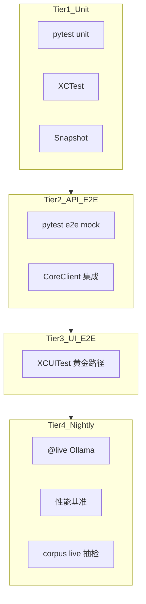

# Lumina 测试指南

**版本**：v1.0  
**真源**：[PRD.md](PRD.md) · [TDD.md](TDD.md)  
**子文档**：[chunking-review.md](testing/chunking-review.md) · [snapshot-guide.md](testing/snapshot-guide.md) · [refusal-corpus.md](testing/refusal-corpus.md) · [bad case 目录](../tests/badcases/README.md)

---

## 1. 概述

Lumina 采用 **「E2E 驱动、单元测试延伸」** 的分层测试策略，覆盖 SwiftUI 原生 App 与 Python `lumina-core` sidecar 的双栈架构。

**核心原则**：

1. 每个 PRD 用户故事（B1–B12、N1–N4）都有对应 **E2E 用例 ID**
2. 每个 E2E 向下延伸 **3–8 个单元测试**，覆盖边界分支
3. **默认 Mock LLM** — CI 快速、确定性
4. **唯一 Live 例外** — 长文本切割 + 真实 Ollama 摘要段 0/1（见 [chunking-review.md](testing/chunking-review.md)）
5. v1.0 引入 **DesignSystem Snapshot**（浅色主题）+ 少量 **XCUITest** 黄金路径

---

## 2. 测试金字塔

```
Tier 4  nightly     @live 全量 + 性能基准 + corpus live 抽检
Tier 3  UI E2E      XCUITest 黄金路径（3–5 条）
Tier 2  API E2E     pytest 全流程（Mock LLM）+ Swift CoreClient 集成
Tier 1  Unit        pytest 模块单测 + XCTest ViewModel/Parser + Snapshot
```



---

## 3. Mock vs Live 边界

| 能力 | PR 默认 | Release 打包 | 完整 live | 说明 |
|------|---------|--------------|-----------|------|
| chunker 边界算法 | unit（纯逻辑） | unit（同 PR） | — | 不依赖 LLM |
| **长文切割 + 摘要段 0/1** | unit + mock e2e | **mock 全量（同 PR）** | **`@live_chunk` 全量** | [E2E-CHUNK-LIVE](#41-e2e-chunk-live) |
| **段摘要质量监督** | 本地规则 unit + Mock 复核/重试 | **同 PR** | `@live_chunk` 人工语义抽检 | 超过 1 个独立问题自动重摘要；资讯摘要暂不覆盖 |
| 段 2+ prefetch | Mock | Mock（同 PR） | nightly optional | |
| 深聊 chat | Mock | Mock（同 PR） | nightly optional | |
| 翻译 | Mock | Mock（同 PR） | nightly optional | |
| 联网搜索 | Mock（mock ddgs） | Mock（同 PR） | nightly optional | |
| 拒答行为 | Mock + corpus | Mock（同 PR） | nightly 抽检 5 条 | [refusal-corpus.md](testing/refusal-corpus.md) |

**理由**：Release 打包门禁与 PR 相同，走 Mock 以保证速度与确定性；长文切割 + 真实摘要质量须手动跑 `@live_chunk` 或 nightly 审阅（见 [chunking-review.md](testing/chunking-review.md)）。

---

## 4. 工具栈

| 层 | 工具 | Marker / 标签 |
|----|------|---------------|
| lumina-core 单测 | pytest + pytest-asyncio + pytest-xdist | 默认 |
| lumina-core API E2E | pytest + httpx `ASGITransport` | `@pytest.mark.e2e` |
| Release 切割 smoke（手动/nightly） | pytest | `@pytest.mark.release_live` |
| 长文切割 live 全量 | pytest | `@pytest.mark.live_chunk` |
| lumina-core 其他 live | pytest | `@pytest.mark.live` |
| 性能 | pytest-benchmark / XCTest `measure` | `@pytest.mark.perf` |
| Swift 单测 | XCTest / Swift Testing | — |
| UI Snapshot | [swift-snapshot-testing](https://github.com/pointfreeco/swift-snapshot-testing) | — |
| UI E2E | XCUITest | `accessibilityIdentifier` |
| 跨栈编排 | just / Makefile + Shell | — |

---

## 5. 目录结构

```
Lumina/
├── packages/lumina-core/tests/
│   ├── conftest.py                 # Mock router、临时 DB、markers
│   ├── fixtures/
│   │   ├── books/                  # 样本书（含 chunk_* live 专用）
│   │   ├── llm/                    # Mock LLM JSON fixture
│   │   └── rss/
│   ├── unit/
│   ├── integration/
│   ├── e2e/                        # API E2E（Mock LLM）
│   └── live/
│       └── test_chunking_live.py   # E2E-CHUNK-LIVE
├── apps/macos/Lumina/
│   ├── LuminaTests/
│   │   ├── Unit/
│   │   ├── Integration/
│   │   └── Snapshot/
│   └── LuminaUITests/
├── tests/
│   ├── fixtures/chat/              # 拒答 corpus
│   ├── badcases/                   # 对话采集的回归目录（draft + catalog）
│   ├── output/                     # chunking_report（gitignore）
│   └── acceptance/                 # PRD §8 MVP 清单
├── docs/testing/                   # 本指南子文档
└── justfile                        # 跨栈测试入口
```

---

## 6. E2E 用例注册表

命名规范：`test_e2e_{story_id}_{slug}` 或文档 ID `E2E-{ID}`。

### 6.0 应用启动（P0）

| ID | PRD | 场景 | 断言 | 层 | LLM |
|----|-----|------|------|-----|-----|
| **E2E-BOOT-01** | §3.4 | 启动时书库/设置/资讯三接口 JSON 契约 | `is_favorite` 为 JSON bool；Swift `BookSummary`/`AppSettings`/`NewsBrief` 可解码 | API unit + XCTest | Mock |
| **E2E-BOOT-02** | §3.4 / §3.5 / §5.9 | Sidecar 启动就绪、冷启动门闩、退出必停、设置可停/重启 | `/health` 即时响应；`GET /startup/status` 阶段至 product-ready；资讯 boot sync 失败/超时放行；`POST /shutdown` 结束 uvicorn；卡死/复用孤儿退出时仍杀端口监听；Swift 连接错误中文 fallback；Release sidecar 冒烟 | API unit + XCTest + release smoke | Mock |

实现：`tests/unit/test_api_swift_contract.py` · `LuminaTests/Unit/CoreClientDecodingTests.swift`

实现（E2E-BOOT-02）：`tests/unit/test_sidecar_startup.py`（含跨栈 `CHUNKER_VERSION` 契约、`POST /shutdown`）· `tests/unit/test_startup_status.py`（`/startup/status` 阶段）· `LuminaTests/Unit/SidecarReadinessTests.swift` · `ColdStartReadinessTests.swift`（本地 XCTest）· `scripts/build-release.sh` sidecar smoke（断言 `/health` JSON `chunker_version`）

### 6.1 Wave 1 — 书库阅读核心（P0）

| ID | PRD | 场景 | 断言 | 层 | LLM |
|----|-----|------|------|-----|-----|
| **E2E-CHUNK-LIVE** | §5.3 | 长文切割 + 摘要段 0/1 | 段长区间、无 overlap、schema、人工 report | live | **真实 Ollama** |
| **E2E-B1** | §5.1 B1 | 批量导入混合格式 | 无 crash；复制到 App Support；元数据 ≥90%；大 TXT 结构扫描有字数进度，无进度超时进导入失败 | API | Mock |
| **E2E-B1-open-with** | §5.1 B1 | macOS Finder 打开方式 | 支持扩展入队导入；不支持立即「格式不支持」；单实例转发路径 | Swift unit | Mock |
| **E2E-B1-formats** | §5.2 | Markdown/HTML/RTF/DOCX/ODT/FB2 导入 | 立即返回 processing；后台 ready；正文可读 | API | Mock |
| **E2E-B1-dup** | TDD §14 | 同 hash 二次导入 | 409 + overwrite 重建 | API | Mock |
| **E2E-B1-dup-skip-rest** | §5.1 | 批量冲突跳过剩下所有 | 后续重复不再弹窗；新书仍导入；与取消剩余导入区分 | Swift/Win unit | Mock |
| **E2E-B1-reject** | TDD §14 | >500MB 拒绝 | 明确错误 | API | Mock |
| **E2E-B2** | §5.3 B2 | 打开书 → 段列表 | 最多 3 层结构树；第一行 `段 N · 章名或 label`；三句话+要点+锚点 | API | Mock |
| **E2E-B11** | §5.3 B11 | 长书导入后立即 open | 段 0 ready；段 1+ pending；SSE 进度 | API + SSE | Mock |
| **E2E-B12** | §5.3.1 B12 | 听稿 summary/detailed/original | 简要=sentences；完整含要点不含 notes/follow_ups；summary 模式不读 raw_text | API | Mock |
| **E2E-B2-switch** | §7.1 | 已缓存段切换 | ≤200ms | perf + XCUITest | — |
| **E2E-B4** | §5.5 B4 | 深聊 10 轮 follow-up | 上下文不丢；每书单 thread | API + SSE | Mock |
| **E2E-B6** | §5.5 B6 | Citation 跳转 | 100% 正确 segment_index | API + XCUITest | Mock |
| **E2E-B7** | §5.5 B7 | 选区 → 深聊 | 选区注入；整段闪高亮 | XCUITest | Mock |
| **E2E-B10** | §6.1 B10 | Ollama-only 闭环 | 零外部 API | API | Mock |

**XCUITest 黄金路径（3 条）**：

| 测试名 | PRD 锚点 |
|--------|----------|
| `UITest_Onboarding_SpotlightDismiss` | §3.4 首次 spotlight 可跳过且不再出现；指南可再打开 |
| `UITest_Reader_ChatCitationJump` | 深聊 → citation → 段高亮 |
| `UITest_OfflineLibraryBrowse` | 无 Ollama 书库可读、AI 灰显 |

### 6.2 Wave 2 — 完整 v1.0

| ID | PRD | 场景 | 层 | LLM |
|----|-----|------|-----|-----|
| **E2E-B3** | §5.4 B3 | 外文书自动译文 | API | Mock |
| **E2E-B3-mode** | §5.4 | 原文/译文/对照切换 ≤200ms | perf | — |
| **E2E-B5** | §5.5 B5 | 联网补充 `[网]` | API + 双端 UI 可点链接 | Mock ddgs |
| **E2E-B5-refuse** | §5.5 | 源中无信息 → 拒答 | API | Mock + corpus |
| **E2E-B8** | §5.6 B8 | ⌘K 跨书搜索跳转 | API + XCUITest | Mock |
| **E2E-B13** | §5.3.2 B13 | 阅读器原文搜索定位 | 只命中 raw_text；响应无 raw_text；偏移可高亮 | API + Swift/Win unit | Mock |
| **E2E-B9** | §5.7 B9 | 100 段导出 Markdown ≤10s | API | Mock |
| **E2E-ingest-ocr** | §5.2 | 扫描 PDF OCR → 摘要 | API | Mock |
| **E2E-ingest-ocr-cloud** | §5.2 | 云端配置完整 → 优先云端 OCR；失败不回退 | API | Mock HTTP |
| **E2E-N1** | §5.8 N1 | sync 50 篇 RSS ≤60s | API | Mock |
| **E2E-N2** | §5.8 N2 | 简报列表 | API | Mock |
| **E2E-N3** | §5.8 N3 | 单篇精读 + 深聊 | API | Mock |
| **E2E-settings** | §5.9 | Ollama 状态 + 三 Profile | API | Mock |
| **E2E-summary-tier** | §5.3 | 正常/高级模型选择、默认正常、空高级模型回退、切档覆盖 | unit + API + 双端契约 | Mock |
| **E2E-boundary-move** | §5.3 | 点击相邻两段拼接原文设分界；原文拼接不变；只重摘要这两段 | unit + API | Mock |

### 6.3 非功能（PRD §7）

| ID | 指标 | 方法 | 阈值 |
|----|------|------|------|
| **E2E-PERF-01** | 首段摘要（长书） | `@live` | ≤15s |
| **E2E-PERF-02** | 首段摘要（短书 ≤12k） | `@live` | ≤30s |
| **E2E-PERF-03** | 深聊首 token | `@live` stream | ≤3s |
| **E2E-PERF-04** | 段切换 | XCUITest `measure` | ≤200ms |
| **E2E-PRIV-01** | Sidecar 127.0.0.1 | 连接测试 | 拒绝外网 bind |
| **E2E-OFFLINE-01** | 无网络书库闭环 | API | 深聊退化文档模式 |

---

## 7. E2E → 单元测试延伸

原则：每个 E2E 至少 3–8 个 unit，覆盖 E2E 无法触达的边界。

| E2E | lumina-core unit | Swift unit / Snapshot |
|-----|------------------|---------------------|
| **E2E-BOOT-01** | `test_api_swift_contract` · `test_books_list_is_favorite_is_json_bool` | `CoreClientDecodingTests` |
| **E2E-BOOT-02** | `test_sidecar_startup` · `test_e2e_boot_02d_health_responds_immediately` · `test_startup_status` · `test_shutdown_sets_uvicorn_should_exit` · `test_macos_stop_kills_port_listener` · `test_e2e_priv_01_settings_default_localhost` | `SidecarReadinessTests` · `ColdStartReadinessTests` |
| **E2E-CHUNK-LIVE** | `test_chunker_chapter_boundary` · `test_chunker_max_segment_size` · `test_chunker_no_overlap_offsets` · `test_short_book_single_segment` · `test_summary_json_schema` | — |
| **B1 导入** | `test_detect_format` · `test_extract_metadata_epub` · `test_copy_to_app_support` · `test_file_hash_dedup` · `test_processing_book_is_segmenting_state` · `test_library_facet_filters` | `LibraryImportPolicyTests` · `LibraryViewModelMergeTests.testSegmentingCollectionIncludesProcessingBooks` · `apps/windows/Lumina.Tests/ModelJsonTests.cs` |
| **B2 段列表** | `test_heading_path_at` · `test_heading_path_from_legacy_chapter_label` · `test_list_catalog_heading_path_and_legacy_chapter_fallback` · `test_summary_json_parse` · `test_label_max_20_chars` · `test_summary_quality`（0/1/2 问题边界、误报、复核降级、带反馈重试） | `SegmentListGroupingTests`（2 层标题 + 折叠 + 无章平铺）· `SegmentCatalog_nests_part_and_chapter` · Snapshot |
| **E2E-boundary-move** | `test_boundary_move` · `test_boundary_api` | `CoreClientDecodingTests.testSegmentBoundaryPreview_decodesCandidates` · `SegmentBoundaryOffsetTests` · `apps/windows/Lumina.Tests/SegmentBoundaryOffsetTests.cs` |
| **B11 prefetch** | `test_same_book_summaries_are_strictly_ordered` · `test_different_books_still_summarize_in_parallel` · `test_final_failure_does_not_block_later_segments` · `test_chat_pauses_prefetch` · `test_job_persist_on_restart` | `ReaderViewModel_SSEHandler` |
| **B12 听文本** | `test_listen_script` · `test_listen_speech_api`（listen-script 路由） | `ListenScriptTests` · `ListenChromePolicyTests` · `ListenSessionTests` · `ReaderChromeClickArchitectureTests.testListenChevronSplitPlaysBriefOnIconClick` · `apps/windows/Lumina.Tests/ListenScriptTests.cs` |
| **B4/B5 深聊** | `test_evidence_sufficiency_router` · `test_chat_dca` · `test_chat_evidence` · `test_web_search` · `test_rollup` · `test_book_scope_chat_after_index` | `CoreClientDecodingTests.testChatResponse_fromSSEDone_parsesMetrics` |
| **B8 笔记/搜索** | `test_fts5_trigger_on_note_insert` · `test_search_group_by_kind` | `SearchViewModel_jumpToSegment` · Snapshot |
| **B13 原文搜索** | `test_original_search` · `test_original_search_api` | `ReaderOriginalSearchTests` · `apps/windows/Lumina.Tests/ModelJsonTests.cs` |
| **B9 导出** | `test_export_includes_translation_by_default` · `test_export_with_notes_optional` · `test_export_sentences_only` | `MarkdownExportModeTests` · `apps/windows/Lumina.Tests/ExportMarkdownModeTests.cs` |
| **E2E-ingest-ocr / cloud** | `test_ocr` · `test_ingest` · `test_import_ocr` · `test_resource_probe` · `test_secrets_store` · `test_release_ocr_bundle` | `CoreClientDecodingTests.testAppSettings_decodesDefaultSettings` |

**LocalAgent 参考测试**（移植为 unit，不直接依赖 LA 代码）：

- `test_chunker_unified.py`
- `test_summarize_segment.py`
- `test_segment_prefetch.py`
- `test_web_search.py`

**摘要质量 Mock 边界**：
- PR 必须确定性覆盖黄金摘要、恰好 1 处允许、2 处触发、同位置去重、古文/专名误报边界，以及质检模型不可用时的本地降级。
- 重试测试必须断言下一轮生成 prompt 含上轮具体字段、问题原因和短片段，并覆盖 full 与 Ollama minimal prompt。
- 连续上下文必须覆盖上一章/本章前文选择、无章节降级、字符预算截断、prompt 消歧与叙事衔接措辞（仍禁止把背景当成本段事实），以及同书顺序/跨书并行/前段最终失败后继续；不断言旧摘要被自动重写。
- Mock 只验证可解释规则、调用编排和状态机；更广泛的事实准确性与语义质量仍由 `@live_chunk` report 人工 sign-off，不以不稳定的 live 输出阻塞 PR。

---

## 8. 本地运行

### 8.1 前置条件

```bash
# Python sidecar 测试
cd packages/lumina-core && uv sync --dev

# live_chunk 额外需要
ollama serve   # 另开终端
ollama pull qwen3.5:4b
```

### 8.2 常用命令

```bash
# 全量 mock 测试（PR 等价）
just test
# 或
pytest -m "not live and not live_chunk and not release_live and not perf" -q

# Bad case 目录完整性（draft 必须空，catalog 指针有效）
python3 scripts/check-badcases.py

# Release 门禁（先 check-badcases，再纯 mock 并行，~20s，与 PR 等价）
just test-release
# 或
./scripts/run-release-tests.sh

# 长文切割 live smoke（手动，需 Ollama；非 release 门禁）
pytest packages/lumina-core/tests/live -m release_live -v

# lumina-core 单测
pytest packages/lumina-core/tests/unit -q

# API E2E（Mock LLM）
pytest packages/lumina-core/tests/e2e -m e2e -q

# 长文切割 live（需 Ollama）
just test-chunking
# 或
pytest packages/lumina-core/tests/live -m live_chunk -v -s

# 生成 chunking 审阅报告
just test-chunking-report

# Swift 单测 + Snapshot（仅本地；PR / just release 默认不跑 XCTest）
just test-macos
# 或
xcodebuild test -project apps/macos/Lumina.xcodeproj -scheme Lumina -destination 'platform=macOS'

# 录制 Snapshot 基线
LUMINA_RECORD_SNAPSHOTS=1 just test-snapshots

# XCUITest
xcodebuild test -scheme Lumina -destination 'platform=macOS' -only-testing:LuminaUITests
```

### 8.3 pytest markers

在 `pyproject.toml` 中注册：

```toml
[tool.pytest.ini_options]
markers = [
    "e2e: API end-to-end tests with Mock LLM",
    "live: tests requiring real Ollama (nightly)",
    "live_chunk: long-text chunking + summarize seg 0/1 with real Ollama",
    "release_live: manual/nightly smoke with truncated fixtures + real Ollama",
    "perf: performance benchmarks",
]
```

---

## 9. CI 流水线

仓库里实际存在的 workflow 只有发布打包，没有 PR 级 `test-macos.yml`。

| Workflow | 触发 | Ollama | 内容 |
|----------|------|--------|------|
| `release.yml` | tag `v*` / 手动 | 否 | `scripts/build-release.sh`（先 mock pytest，再打包；sidecar smoke 校验 `/health` 的 `chunker_version`） |
| `release-windows.yml` | tag `v*` / 手动 | 否 | Windows 打包 |

**PR / `just test` 门禁**：lumina-core mock pytest。**默认不跑 XCTest。** Swift 与 Python 的 sidecar 握手由 pytest 读 [`SidecarReadiness.swift`](../apps/macos/Lumina/Services/SidecarReadiness.swift) 源码断言 `expectedChunkerVersion == CHUNKER_VERSION`（见 `test_macos_sidecar_expected_chunker_version_matches_core`）。本地可跑 `just test-macos`。

**Release 必过门禁**：[`scripts/check-badcases.py`](../scripts/check-badcases.py)（`tests/badcases/draft.jsonl` 为空且 catalog 指针有效）+ mock pytest（见 [`run-release-tests.sh`](../scripts/run-release-tests.sh)）+ 嵌入 sidecar 的 `/health` JSON `chunker_version` 必须等于 Python `CHUNKER_VERSION`。`xcodebuild test` **不是** release 步骤（只 `build`）。

**Wave 1 Dogfood Gate**：

- [ ] E2E-CHUNK-LIVE 两份 fixture 通过 + [chunking report 人工 sign-off](testing/chunking-review.md)
- [ ] DesignSystem Snapshot 基线入库

---

## 10. PR Checklist

新增或修改功能时，PR 描述须包含：

- [ ] 对应 **E2E 用例 ID**（或说明为何不适用）
- [ ] 已补充 **unit 测试**（每个 E2E ≥3 条延伸）
- [ ] 若改 `chunker/` 或 `summarize/`：已跑 **`@live_chunk`** 并附 report 链接/截图
- [ ] 若改 SwiftUI 组件：已更新 **Snapshot**（或说明无 UI 变更）
- [ ] 若改深聊拒答逻辑：已更新 [refusal corpus](testing/refusal-corpus.md) 相关条目
- [ ] 对话中确认的坑已写入 [bad case 目录](../tests/badcases/README.md)（draft 升 catalog，并补测试或规则）
- [ ] 所有交互控件有 **`accessibilityIdentifier`**（XCUITest 需要）

**推荐顺序**：先写 E2E（定义验收）→ 再拆 unit（覆盖边界）→ 最后 Snapshot / XCUITest。

---

## 11. Mock LLM 机制

`conftest.py` 注入 `MockModelRouter`，按 profile 返回 fixture：

```python
@pytest.fixture
def mock_router(monkeypatch):
    router = MockModelRouter(responses={
        "summarize": load_json("fixtures/llm/summary_segment0.json"),
        "chat": load_json("fixtures/llm/chat_with_citation.json"),
        "translate": "译文 fixture…",
    })
    monkeypatch.setattr("lumina_core.models.router.get_router", lambda: router)
```

**`@live_chunk` 测试不注入 `mock_router`** — 仅 `summarize` profile 走真实 Ollama。

Fixture 目录：`packages/lumina-core/tests/fixtures/llm/`

| 文件 | 用途 |
|------|------|
| `summary_segment0.json` | 段摘要 JSON mode（TDD §4.3） |
| `chat_with_citation.json` | 深聊 + `[段 N]` |
| `chat_with_web_refs.json` | 深聊 + `[网]` |
| `chat_refusal.json` | 拒答结构 |

---

## 12. 覆盖率目标

| 范围 | 目标 | 说明 |
|------|------|------|
| lumina-core | ≥80% 行覆盖 | unit + e2e mock |
| Swift ViewModel | ≥70% | 不含 SwiftUI body |
| PRD 用户故事 | 100% 有 E2E ID | 不要求每条都有 XCUITest |
| 拒答 corpus | ≥20 条 reviewed | 与产品共建 |

---

## 13. 子文档索引

| 文档 | 内容 |
|------|------|
| [testing/chunking-review.md](testing/chunking-review.md) | E2E-CHUNK-LIVE 人工审阅流程 |
| [testing/snapshot-guide.md](testing/snapshot-guide.md) | Snapshot 录制与 CI |
| [testing/refusal-corpus.md](testing/refusal-corpus.md) | 拒答测试集共建指南 |
| [badcases/README.md](../tests/badcases/README.md) | 对话 bad case 采集、升格与发布检查 |

---

## 14. 开发分期对齐

| Phase | 测试交付物 |
|-------|-----------|
| **Phase 0** | conftest、markers、justfile、fixture 骨架 |
| **Phase 1** | E2E-CHUNK-LIVE、Wave 1 mock E2E、Snapshot 基线、1 条 XCUITest |
| **Phase 2** | 拒答 corpus ≥20 条、Wave 2 E2E、Citation/⌘K XCUITest |
| **Phase 3** | nightly @live、perf 基准、corpus live 抽检 |
